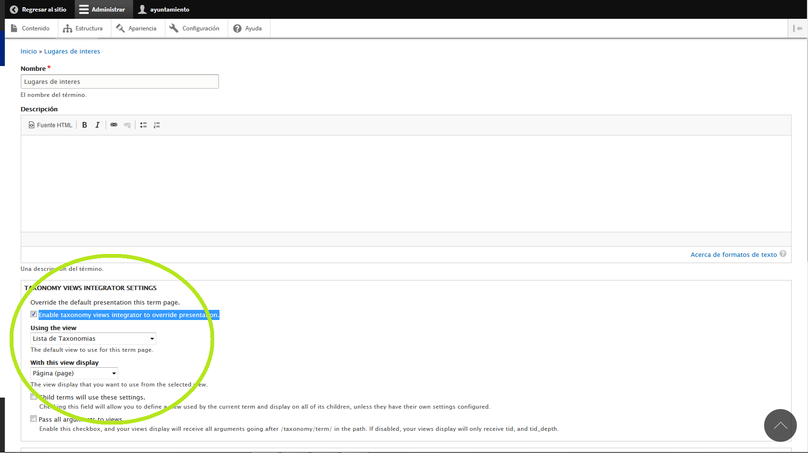
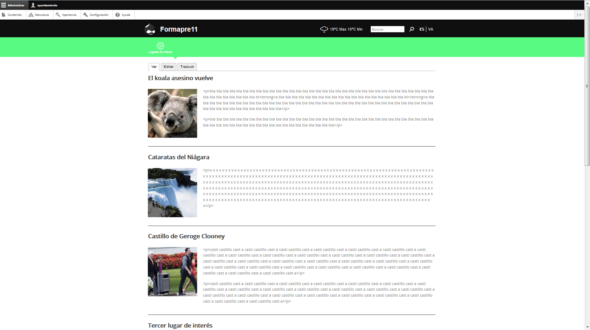

Gestión de nuestro Portal Web Municipal
=======================================
Optional Author Name <jcatala@dipcas.es>
Optional version 1.0, optional 12/10/2017
:Author:    SEPAM - DIPUTACIO DE CASTELLO
:Email:     <grupotic@dipcas.es>
:Date:      20/10/2017
:Revision:  1.1
:doctype: book
:source-highlighter: coderay
:listing-caption: Listing
:pdf-page-size: A4
:toc: left
// :toc-placement!:
:toc-title: Índice de contenidos
toc::[]

// *************************************************************************************
== Sobre este documento
// *************************************************************************************
El SEPAM (Servicio Provincial de Asesoramiento a Municipios) de la Excma. Diputación de
 Castellón, pone en marcha en 2007, de manera oficial, el Proyecto Portal Web Municipal, 
el cual trata sobre la creación de un portal web municipal oficial desarrollado dentro de
 los planes de asistencia técnica de la Diputación de Castellón con las Entidades Locales 
de la provincia de Castellón. El proyecto forma parte del Catálogo de Fuentes Abiertas de
 CENATIC ( Centro Nacional de Referencia de Aplicaciones de las TIC basadas en fuentes 
abiertas ) ya que todos los portales web están desarrollados al 100% con Software Libre, 
incluyendo un gestor de contenidos basado en Drupal y el almacenamiento en servidores
GNU/Linux gestionados por la Diputación de Castellón.

El objetivo principal es garantizar la presencia en internet de todas las EELL de la 
provincia por pequeñas
que éstas sean, formar también en temas avanzados como Accesibilidad y/o Usabilidad e 
impulsar el acceso electrónico de los ciudadanos de la provincia a la administración local.

La dirección web del Proyecto es: http://sepam.dipcas.es/portals

Este manual, junto a los cursos formativos que la Diputación de Castellón realizamos cada 
año a los responsables de las webs municipales, enseña a gestionar, autoeditar y mantenimer 
los portales web municipales, y orienta en aspectos complementarios como la Accesibilidad 
Web, la Usabilidad, la organización eficiente de la información así como en temas 
relacionados con la promoción en el amplio espectro que forman hoy en día las llamadas 
Redes Sociales.

Este documento está desarrollado con Asciidoctor y está en constante evolución a medida 
que aparecen dudas y propuestas de los responsables de las webs municipales.

// *************************************************************************************
== Sobre el Proyecto Web Municipal
// *************************************************************************************
El portal web municipal de Informàtica Municipal (SEPAM), ha sido desarrollado 
completamente con software libre, usando el Gestor de Contenidos DRUPAL bajo un servidor 
GNU/Linux con NGINX o Apache, y como gestor de bases de datos MySQL.

// *************************************************************************************
== EELL que conforman el Proyecto Web Municipal
// *************************************************************************************
A continuación, disponeís de un listado de todas las Entidades Locales de la provincia de 
Castellón que están adheridas al Proyecto Web Municipal de la Diputación de Castellón, 
ordenadas y clasificadas por los CEDES a los que pertenecen.

.Tabla de EELL adheridas
[options="header,footer"]
|===========================================================================
|CODI|AJUNTAMENT|CEDES
|L01120038|AYTO. ALBOCÀSSER|ALBOCÀSSER
|L01120265|AYTO. BENASSAL|ALBOCÀSSER
|L01120363|AYTO. CANET LO ROIG|ALBOCÀSSER
|L01120424|AYTO.  CATÍ|ALBOCÀSSER
|L01120445|AYTO.  CERVERA DEL MAESTRE|ALBOCÀSSER
|L01120509|AYTO.  LES COVES DE VINROMÀ|ALBOCÀSSER
|L01120516|AYTO.  CULLA|ALBOCÀSSER
|L04120001|E.L.M. EL BALLESTAR|ALBOCÀSSER
|L01120705|AYTO.  JANA, LA|ALBOCÀSSER
|L01120960|AYTO.  ROSSELL|ALBOCÀSSER
|L01120982|AYTO.  SALZADELLA, LA|ALBOCÀSSER
|L01121016|AYTO.  SAN RAFAEL DEL RÍO|ALBOCÀSSER
|L01120995|AYTO.  SANT JORDI/SAN JORGE|ALBOCÀSSER
|L01121009|AYTO.  SANT MATEU|ALBOCÀSSER
|L01121037|AYTO.  SERRATELLA, LA|ALBOCÀSSER
|L01121114|AYTO.  TÍRIG|ALBOCÀSSER
|L01121212|AYTO.  TRAIGUERA|ALBOCÀSSER
|L01121346|AYTO.  VILAR DE CANES|ALBOCÀSSER
|L01120521|AYTO.  XERT|ALBOCÀSSER
|L05120005|MANCOMUNIDAD CASTELLÓ NORD|ALBOCÀSSER
|L05120008|MANCOMUNIDAD BAIX MAESTRAT|ALBOCÀSSER
|L05120010|MANCOMUNITAT ALT MAESTRAT|ALBOCÀSSER
|L01120022|AYTO.  AÍN|CASTELLÓ
|L01120043|AYTO.  ALCALÀ DE XIVERT|CASTELLÓ
|L01120056|AYTO.  L'ALCORA|CASTELLÓ
|L01120094|AYTO.  ALMASSORA|CASTELLÓ
|L01120115|AYTO.  ALMENARA|CASTELLÓ
|L01129018|AYTO.  LES ALQUERIES|CASTELLÓ
|L01120154|AYTO.  ARGELITA|CASTELLÓ
|L01120167|AYTO.  ARTANA|CASTELLÓ
|L01120173|AYTO.  AYÓDAR|CASTELLÓ
|L01120271|AYTO.  BENICARLÓ|CASTELLÓ
|L01120287|AYTO.  BENICASIM/BENICÀSSIM|CASTELLÓ
|L01120213|AYTO.  BETXÍ|CASTELLÓ
|L01120326|AYTO.  BORRIANA/BURRIANA|CASTELLÓ
|L01120311|AYTO.  BORRIOL|CASTELLÓ
|L01120347|AYTO.  CÀLIG|CASTELLÓ
|L01120402|AYTO.  CASTELLÓ DE LA PLANA|CASTELLÓ
|L01120537|AYTO.  CHILCHES/XILXES|CASTELLÓ
|L01120461|AYTO.  CIRAT|CASTELLÓ
|L01120574|AYTO.  ESLIDA|CASTELLÓ
|L01120580|AYTO.  ESPADILLA|CASTELLÓ
|L01120593|AYTO.  FANZARA|CASTELLÓ
|L01120640|AYTO.  FUENTES DE AYÓDAR|CASTELLÓ
|L01120748|AYTO.  LLOSA, LA|CASTELLÓ
|L01120770|AYTO.  MONCOFA|CASTELLÓ
|L01120825|AYTO.  NULES|CASTELLÓ
|L01120846|AYTO.  ONDA|CASTELLÓ
|L01120859|AYTO.  OROPESA DEL MAR/ORPESA|CASTELLÓ
|L01120897|AYTO.  PENÍSCOLA|CASTELLÓ
|L01120957|AYTO.  RIBESALBES|CASTELLÓ
|L01129023|AYTO.  SANT JOAN DE MORÓ|CASTELLÓ
|L01121021|AYTO.  SANTA MAGDALENA DE PULPIS|CASTELLÓ
|L01121080|AYTO.  SUERAS/SUERA|CASTELLÓ
|L01121093|AYTO.  TALES|CASTELLÓ
|L01121135|AYTO.  TOGA|CASTELLÓ
|L01121166|AYTO.  TORRALBA DEL PINAR|CASTELLÓ
|L01121172|AYTO.  TORREBLANCA|CASTELLÓ
|L01121188|AYTO.  TORRECHIVA|CASTELLÓ
|L01121264|AYTO.  VALL D'UIXÓ, LA|CASTELLÓ
|L01121233|AYTO.  VALLAT|CASTELLÓ
|L01121359|AYTO.  VILA-REAL|CASTELLÓ
|L01121362|AYTO.  VILAVELLA, LA|CASTELLÓ
|L01121310|AYTO.  VILLAMALUR|CASTELLÓ
|L01121384|AYTO.  VINARÓS|CASTELLÓ
|L05120002|MANCOMUNIDAD INTERMUNICIPAL DEL ALTO MIJARES|CASTELLÓ
|L05120003|MANCOMUNIDAD ESPADAN MIJARES|CASTELLÓ
|L01120069|AYTO.  ALCUDIA DE VEO|CASTELLÓ
|L01120419|AYTO.  CASTILLO DE VILLAMALEFA|LLUCENA
|L01120483|AYTO.  CORTES DE ARENOSO|LLUCENA
|L01120496|AYTO.  COSTUR|LLUCENA
|L01120607|AYTO.  FIGUEROLES|LLUCENA
|L01120727|AYTO.  LLUCENA/LUCENA DEL CID|LLUCENA
|L01121303|AYTO.  VILLAHERMOSA DEL RÍO|LLUCENA
|L01120733|AYTO.  LUDIENTE|LLUCENA
|L01121423|AYTO.  ZUCAINA|LLUCENA
|L01120141|AYTO.  ARES DEL MAESTRAT|MORELLA
|L01120379|AYTO.  CASTELL DE CABRES|MORELLA
|L01120385|AYTO.  CASTELLFORT|MORELLA
|L01120458|AYTO.  CINCTORRES|MORELLA
|L01120614|AYTO.  FORCALL|MORELLA
|L01120688|AYTO.  HERBÉS|MORELLA
|L01120803|AYTO.  MORELLA|MORELLA
|L01120751|AYTO.  MATA DE MORELLA, LA|MORELLA
|L01120831|AYTO.  OLOCAU DEL REY|MORELLA
|L01120878|AYTO.  PALANQUES|MORELLA
|L01120939|AYTO.  POBLA DE BENIFASSÀ, LA|MORELLA
|L01120918|AYTO.  PORTELL DE MORELLA|MORELLA
|L01121129|AYTO.  TODOLELLA|MORELLA
|L01121299|AYTO.  VILLAFRANCA DEL CID/VILAFRANCA|MORELLA
|L01121270|AYTO.  VALLIBONA|MORELLA
|L01121378|AYTO.  VILLORES|MORELLA
|L01121418|AYTO.  ZORITA DEL MAESTRAZGO|MORELLA
|L05120007|MANCOMUNIDAD COMARCAL ELS PORTS|MORELLA
|L01120075|AYTO.  ALFONDEGUILLA|SEGORBE
|L01120081|AYTO.  ALGIMIA DE ALMONACID|SEGORBE
|L01120108|AYTO.  ALMEDÍJAR|SEGORBE
|L01120120|AYTO.  ALTURA|SEGORBE
|L01120136|AYTO.  ARAÑUEL|SEGORBE
|L01120189|AYTO.  AZUÉBAR|SEGORBE
|L01120206|AYTO.  BARRACAS|SEGORBE
|L01120228|AYTO.  BEJÍS|SEGORBE
|L01120249|AYTO.  BENAFER|SEGORBE
|L01120398|AYTO.  CASTELLNOVO|SEGORBE
|L01120430|AYTO.  CAUDIEL|SEGORBE
|L01120568|AYTO.  CHÓVAR|SEGORBE
|L01120635|AYTO.  FUENTE LA REINA|SEGORBE
|L01120653|AYTO.  GAIBIEL|SEGORBE
|L01120672|AYTO.  GELDO|SEGORBE
|L01120691|AYTO.  HIGUERAS|SEGORBE
|L01120712|AYTO.  JÉRICA|SEGORBE
|L01120764|AYTO.  MATET|SEGORBE
|L01120786|AYTO.  MONTÁN|SEGORBE
|L01120799|AYTO.  MONTANEJOS|SEGORBE
|L01120810|AYTO.  NAVAJAS|SEGORBE
|L01120884|AYTO.  PAVÍAS|SEGORBE
|L01120901|AYTO.  PINA DE MONTALGRAO|SEGORBE
|L01120923|AYTO.  PUEBLA DE ARENOSO|SEGORBE
|L01120976|AYTO.  SACAÑET|SEGORBE
|L01121042|AYTO.  SEGORBE|SEGORBE
|L01121068|AYTO.  SONEJA|SEGORBE
|L01121074|AYTO.  SOT DE FERRER|SEGORBE
|L01121107|AYTO.  TERESA|SEGORBE
|L01121140|AYTO.  TORÁS|SEGORBE
|L01121153|AYTO.  TORO, EL|SEGORBE
|L01121251|AYTO.  VALL DE ALMONACID|SEGORBE
|L01121331|AYTO.  VILLANUEVA DE VIVER|SEGORBE
|L01121401|AYTO.  VIVER|SEGORBE
|L05120006|MANCOMUNIDAD INTERMUNICIPAL DEL ALTO PALANCIA|SEGORBE
|L01120017|AYTO.  ATZENETA DEL MAESTRAT|VALL D'ALBA
|L01120252|AYTO.  BENAFIGOS|VALL D'ALBA
|L01120290|AYTO.  BENLLOCH|VALL D'ALBA
|L01120332|AYTO.  CABANES|VALL D'ALBA
|L01120555|AYTO.  CHODOS/XODOS|VALL D'ALBA
|L01120944|AYTO.  POBLA TORNESA, LA|VALL D'ALBA
|L01121055|AYTO.  SIERRA ENGARCERÁN|VALL D'ALBA
|L01121191|AYTO.  TORRE D'EN BESORA, LA|VALL D'ALBA
|L01121205|AYTO.  LA TORRE D'EN DOMÈNEC|VALL D'ALBA
|L01121227|AYTO.  USERAS/USERES, LES|VALL D'ALBA
|L01121248|AYTO.  VALL D'ALBA|VALL D'ALBA
|L01121286|AYTO.  VILAFAMÉS|VALL D'ALBA
|L01121325|AYTO.  VILANOVA D'ALCOLEA|VALL D'ALBA
|L01121397|AYTO.  VISTABELLA DEL MAESTRAT|VALL D'ALBA
|L05120009|MANCOMUNITAT PLANA ALTA|VALL D'ALBA
|CODI|AJUNTAMENT|CEDES
|===========================================================================

// *************************************************************************************
== Cómo son las Web Municipales
// *************************************************************************************
El portal Web municipal es la presencia del Municipio en la Red. A través del portal 
municipal las Entidades Locales (EELL) pueden hacer llegar a todos sus ciudadanos los 
objetivos de su de gestión, los logros e iniciativas desarrolladas, convocar actividades, 
dar a conocer la agenda cultural, deportiva o tributaria, y servir de lugar de encuentro 
de las iniciativas locales.

Los portales municipales que gestionamos la Diputación de Castellón son portales web para 
los municipios de nuestra provincia de Castellón, y tienen una nueva estructura minimalista, 
clara, usable, accesible y muy bién adaptada a todo tipo de dispositivos, y al mismo tiempo 
muy fáciles de gestionar para los responsables de las webs a la hora de publicar contenidos, 
modificar textos, eliminar páginas antiguas o ampliar nuevas secciones. 

Algunas de las características derivadas de la utilización de este gestor de contenidos son:

*  Sin coste para el ayuntamiento.
*  Multilenguaje (de manera opcional)
*  Web modificable por temas (plantillas estéticas usando CSS).
*  Formularios de contacto con el Ayto. personalizables.
*  Buscador avanzado dentro de la propia web: busca artículos, noticias, usuarios, etc.
*  Mapa web: previsualización del esquema global de la web.
*  Cumplimiento de los estándares de accesibilidad, XHTML 1.0 y RSS .
*  Editor avanzado para la publicación de contenido.
*  Posibilidad de insertar notícias de forma fácil (con XHTML), videos, animaciones con flash, 
banners aleatorios, etc. sin necesidad de tener conocimientos técnicos sobre HTML.
*  Artículos e historias organizables también por categorías: artículos privados, artículos 
públicos, artículos del pueblo, artículos de turismo, artículos de concejalías, artículos de 
casas rurales, etc..
*  Sindicación de contenido (RSS).
*  Web multiusuario con múltiples roles: posibilidad de categorizar a los usuarios y dar (o 
denegar) permisos a ciertos roles o a ciertos usuarios concretos.
*  Gestión de usuarios, rols, permisos de acceso, etc.
*  Compartir información privada (carpetas, archivos, etc.) para determinados usuarios. Una 
característica muy útil para intranets o para insertar/consultar documentos desde cualquier 
lugar.
*  Publicación de encuestas de opinión.
*  Flexibilidad.
*  Facilidad de administración.
*  Se hacen copias de seguridad periódicas de la web y de la base de datos para garantizar la 
fiabilidad y estabilidad de la web.
*  Extensa comunidad de usuarios que usan DRUPAL. Enorme documentación y foros de información
(usuarios, administraciones y empresas) que hacen crecer la plataforma web cada día.
*  Validación XHTML 1.0, CSS, RSS y cumple la triple A del TAW de la accesibilitat (Ley 
34/2002 de 11 de julio de 2005).
*  Inclusión en el plan de formación de la Diputación.

// *************************************************************************************
=== Estructura común de las Webs Municipales
// *************************************************************************************
Debes saber que los tipos de contenido pueden ser muy variados: el menú principal con sus 
subopciones que cuelgan de manera vistosa, las noticias informativas que aparecen en la 
portada, los eventos de la Agenda, los carteles que publiques, las galerías de imágenes, 
los carruseles de imágenes en movimiento y otros.

Las webs municipales incluyen tipos de contenido que pueden utilizarse muy fácilmente y que 
todos se organizan de manera dinámica sin necesidad de conocimientos de programación. 

Cada uno de estos elementos pueden ser utilizados en distintos lugares y con distintas 
presentaciones, y todas las configuraciones las puede realizar sin dificultad el webmaster 
del portal. Los elementos són contenidos individules o agrupaciones que comparten una misma 
naturaleza y que se muestran con un formato predefinido.

En los ayuntamientos hay un publicador "webmaster" y otro publicador "redactor", aunque es 
posible crear más usuarios publicadores de la web sin límite alguno, por si algún 
ayuntamiento tiene distintas áreas o secciones y requiere de un número mayor de 
publicadores.

A continuación os mostramos los distintos temas gráficos que podemos usar en estas webs 
municipales.

// *************************************************************************************
=== Temas gráficos
// *************************************************************************************
Las webs municipales parte de una base estándard, a nivel de Drupal, donde hemos preparado 
las categorías y un menú de estructuras de taxonomías comunes, pero ofrecemos hasta 10 
temas gráficos personalizados para que, junto con modificaciones del color y de las 
imágenes y escudos en sí, las webs municipales sean distintas las unas de las otras, 
aunque el objetivo del SEPAM es mantener un poco la coherencia y la cohesión entre todas 
las webs municipales.

Estos son los 10 temas gráficos que ofrecemos a las EELL de la provincia de Castellón:

==== Tema BORA

==== Tema CALIMA

==== Tema  GALERNA

==== Tema LEVANTE

==== Tema MISTRAL

==== Tema SHAMAL

==== Tema TRAMONTANA

==== Tema PAMPERO

==== Tema MONZON

==== Tema MARIN

// *************************************************************************************
== Accediendo al Portal Web Municipal
// *************************************************************************************
Podemos acceder a nuestro portal web muncipal añadiendo */user* al final de nuestra 
dirección url, por ejemplo, si nuestro municipio es Cabanes, accederemos a nuestra web 
escribiendo *www.cabanes.es/user*

Y nos solicitará que introduzcamos nuestro usuario y contraseña para poder gestionar los 
contenidos de la web.

Por motivos de seguridad, recuerda salir de la sesión cuando finalices las tareas de 
publicación. Puedes salir de la sesión pulsando sobre tu usuario (en la barra superior 
de la página, una vez hayas accedido) y a continuación pulsando en 'Cerrar sesión'.

// *************************************************************************************
== Cambiar algunos aspectos gráficos
// *************************************************************************************
Si queremos modificar un poco la parte gráfica de nuestro portal web municipal, iremos a
a la opción "Apariencia" + "Ajustes" de nuestro tema, y aquí podremos cambiar el escudo 
de nuestra web y también subir una nueva imagen de fondo.

// *************************************************************************************
== Listar todos los contenidos de la web
// *************************************************************************************
En nuestras webs municipales tenemos Noticias, Páginas sencillas, Bandos, Eventos, etc, 
y es probable que pasado un cierto tiempo quieras volver a editar un contenido antiguo, 
o recuperarlo para coger alguna información, o incluso eliminarlo.

Pues bién, para listar todos los contenidos de la web, iremos a "Contenido" en el menú 
superior. Aquí tenemos todas las noticias, todas las páginas simples, todos los bandos, 
etc. 

Desde este mismo lugar, en "Contenidos", también podemos editar los contenidos (desde la 
opción editar de la derecha) así como también eliminar cualquier contenido.

// *************************************************************************************
== Buscar contenidos de la web
// *************************************************************************************
En este apartado "Contenidos", tenemos un buscador que podemos usar para buscar cualquier 
contenido que tengamos en nuestra web y que necesitemos editar o gestionar. En el 
siguiente ejemplo, queríamos encontrar una página llamada "Cataratas del Niágara" y hemos 
buscado 'Niágara' en el buscador.

// *************************************************************************************
== Crear, modificar y gestionar la estructura
// *************************************************************************************
Para gestionar la esturctura de la web, iremos a "Estructura" + "Taxonomías" + "Lista de 
términos". Y desde aquí tenemos todas las Secciones y Servicios y Subservicios de nuestra 
web.

=== Crear una nueva sección

Para crear una nueva sección, hacemos click en el botón superior "Nuevo término" y ahora 
simplemente debemos especificar un nombre, un icono, un color (con el formato hexadecimal) 
y su posición. Pero, como vamos a crear una Sección, la posición (o el campo "Términos 
padres") debe ser "Raíz".

IMPORTANTE: no hay que escribir nada en el campo "Descripción". 

=== Crear un nuevo servicio

Para crear un nuevo servicio, haremos lo mismo que en el apartado anterior, donde hemos 
creado una nueva sección, pero en el campo "Términos padres" le diremos a qué sección 
pertenece.

Por ejemplo, si vamos a crear un servicio llamado "Discotecas" y lo queremos para los 
usuarios que visitan nuestra web, marcaríamos como elemento padre a la sección 
"Visitantes". 

A continuación os dejamos un ejemplo:

=== Crear un nuevo subservicio

Un subservicio es un tercer nivel. El primer nivel era crear una sección, el segundo era 
un servicio dentro de una sección. 
Pues bién, llamamos subservicio a un tercer nivel que se encuentra dentro de un servicio. 
Por ejemplo la siguiente imagen que pertenece a la sección "Golf Panorámica" del 
Ayuntamiento de Sant Jordi:

Crearemos un subservicio de la misma manera que hemos creado una sección o un servicio, 
en los dos apartados anteriores, a diferencia que en el campo "Términos padres" debemos 
especificar que cuelga dentro de un servicio. Y la página se visualizará como la de Sant 
Jordi, es decir, aparecerá una columna que muestra cajitas con los subservicios.

=== Crear un listado de contenidos

Con las webs municipales, podemos crear listados de contenidos de manera libre y fácil. 
Por ejemplo podríamos crear un servicio que muestre:

* Listado de monumentos del municipio
* Listado de edificios institucionales
* Listado de personas ilustres
* Listado de Asociaciones
* Listado de instalaciones deportivas

Para ello, debemos saber que hay que configurar la Sección o Servicio que queramos que 
se convierta en un listado, y habilitar la casilla llamada "Enable taxonomy views 
integrator to override presentation." y  a continuación, hay que elegir "Lista de 
Taxonomías" y "Pagina (Page)", tal y como muestra la imgen:

Y ahora, ya puedes ir publicando "Páginas sencillas" de la temática del listado que 
desees crear, pero le marcarás la Sección o Servicio donde quieras que se vayan listado.

Por ejemplo, mira la siguiente captura de pantalla donde tenemos un listado de pruebas 
que realizamos durante las jornadas formativas y que hemos llamado "Lugares de interés":

=== Eliminar una sección o servicio

En todo momento podemos crear secciones o servicios, pero también eliminarlos cuando no 
los necesitemos. Si queremos eliminar una sección o un servicio de la web, iremos a 
Estructura y haremos click en el botón de la derecha que acompaña a cada Sección/Servicio, 
y veremos que se nos desplega la opción "Eliminar".

// *************************************************************************************
== Publicación de contenidos
// *************************************************************************************
Una vez tenemos creada nuestra estructura de la web (los pilares de la casa) ahora es 
necesario publicar los contenidos y dotar a esa estructura de información, ya sea con 
páginas, bandos, noticias, etc. A continuación vamos a repasar uno a uno todos los 
distintos tipos de contenidos que podemos utilizar en las webs municipales.

=== Publicar un bando municipal

Un bando es una publicación directa, rápida y escueta. Publicaremos un bando desde 
"Contenido" + "Agregar contenido" + "Bandos". Y solo necesitamos escribir un título y una 
frase escueta en el cuerpo del bando. Y luego debemos marcar la fecha de inicio y 
finalización que queremos que aparezca el bando en la parte superior de la web.

Una vez lo publicamos, los bandos quedan en la parte superior de la web con un fondo gris y 
texto de color rojo, como en la siguiente imagen:

=== Publicar una noticia con una imagen

Publicaremos una imagen desde "Contenido" + "Agregar contenido" y deberemos introducir un 
título, el texto en el cuerpo, categorizar nuestra publicación de alguna manera aproximada 
y en el campo imagen podemos subir la foto. Es necesario poner un texto alternativo, ya 
que de lo contrario el sistema de publicación no nos dejará guardar la imagen y nos pintará 
de color rojo el campo obligatorio.

=== Publicar una noticia con varias imágenes

Si en lugar de una, queremos publicar varias imágenes, subimos las fotos también en el campo 
imagen, podemos subir muchas a la vez:

Y una vez publicada la noticia, las fotos tendrán unas bolitas grises debajo para que 
podamos ir navegando y viendo todas las fotos, o moviéndolas de derecha a izquierda para 
la navegación con smartphone o tablet.

=== Publicar una noticia con uno o varios enlaces a webs

En el cuerpo de las noticias, disponemos de un botón para escribir en negrita, otro para 
escribir en cursiva, otros dos para listas (ordenadas y listas sin ordenador con bolitas 
negras) y también un icono con una cadena que sirve para enlazar palabras. Si seleccionamos 
una o varias palabras y hacemos click en el icono, se nos abrirá una ventanita emergente 
donde, si por ejemplo queremos poner un enlace de la Diputación de Castellón, escribiremos 
http://www.dipcas.es

=== Publicar una noticia con un video de Youtube

Podemos incrustar videos que están publicados en Youtube muy fácilmente, puesto a que 
Youtube nos ofrece una manera de realizar esto. Para ello, accederemos al video que 
queramos tener en nuestra web y le damos al enlace de "Compartir" el cual siempre 
aparece bajo los videos.

Y a continuación debemos darle al enlace de "Incrustar", que nos ofrecerá un código 
parecido a este:

[source,html]
----
<iframe width="560" height="315" src="https://www.youtube.com/embed/hvvme-WMzQM" 
frameborder="0" allowfullscreen></iframe>
----

Ahora dejaremos este código en el cuerpo de la noticia, pero previamente tenemos que 
activar el botón del HTML, ya que el código que nos
ofrece Youtube es lenguaje HTML.

Y por último, fíjate que para que el video se expanda completamente de derecha a 
izquierda, hemos cambiado el parámetro "width" (ancho, en inglés) cambiando '560' por 
'100%', y así se visualizará correctamente en televisores, smartphones, tablets, 
ordenadores fijos, ordenadores portátiles, etc, independientemente de la resolución y 
tamaño de las pantallas. 

Ahora, una vez guardes la noticia o página, no utilizarás el ancho de banda de nuestra 
web sino de Youtube, que es muy grande y tiene mucha capacidad para el 'streamming' de 
video, como ya sabrás. 

Muchas veces nos preguntan cómo pueden subir videos a las webs municipales, pero 
nosotros siempre recomendamos crear una cuenta en Youtube, subirlos a vuestra cuenta y 
luego incrustarlos en vuestras webs municipales, ya que es muy fácil como acabáis de ver.

 

=== Publicar una noticia con una galería de fotos de Flickr

Flickr es una red social muy buena y profesional, propiedad de Yahoo, que ofrece 1 TB 
de espacio gratuito en fotografías y videos de alta calidad. Si te registras, puedes 
crearte un espacio donde albergar tus álbumes públicos o privados, compartirlo con tus 
contactos, comentar en fotos de tus contactos, etc. Es una excelente plataforma pionera 
en esto de los álbumes de fotos.

En este apartado vamos a mostrarte una cuenta de Flickr de pruebas, donde hemos creado 
2 álbumes, uno de capturas de pantalla y otro de cursos varios. Lo más correcto sería 
que tu Ayuntamiento también cree una cuenta oficial en Flickr y allí vayáis subiendo 
álbumes de fotos que posteriormente incrustaréis en vuestra página web municipal, al 
igual que acabamos de realizar con videos de Youtube en el apartado anterior. 

Flickr es muy elegante y rápido, y también dispone de una App para smartphones y tablets. 

Vamos a compartir el álbum de fotos "Cursos PWM" y vamos a insertarlo en nuestra web 
municipal. Para ello, accedemos a nuestro álbum de fotos y le damos al icono de 
compartir, tal y como se muestra en la captura de pantalla siguiente:

A continuación seleccionaremos el código HTML que Flickr nos ofrece desde la opción 
"Embed" tal y como te mostramos en la siguiente captura de pantalla:

Y finalmente, simplemente debemos volver a nuestra web municipal, activar el botón HTML 
en el cuerpo de la noticia o página, y pegarlo.

Recuerda también que, si quieres que la galería se muestre completamente de izquierda a 
derecha, debemos cambiar el parámetro "width" y poner width="100%".

Debemos hacer una aclaración aquí: por cuestiones de geometría, deberíais siempre publicar 
fotos horizontales, ya que la visión de las webs es horizontal (leemos de izquierda a 
derecha), la tendencia es que los monitores son horizontales (a excepción de las pantallas 
de los smartphones, donde por defecto leemos en modo vertical). Hacemos meción a este tema 
porque, si quieres publicar la fotografía de una persona y haces la foto vertical, luego 
al publicarla en la web, como se visualizarán en modo horizontal, la parte superior y la 
parte inferior de la imagen saldrán cortadas. Es importante hacer las fotos horizontales 
siempre.

=== Publicar una página sencilla

Las páginas no son noticias, y por lo tanto no son contenidos a publicar regularmente. Las 
páginas son contenidos estáticos para informar de información sobre nuestro pueblo o poner 
el horario de autobuses, por ejemplo, por lo tanto las páginas deben tener información 
directa, relevante y minimalista en la medida de lo posible. 

Para publicar una página sencilla, iremos a "Contenidos" + "Agregar contenido" y 
seleccionaremos página sencilla.

Aquí no cambia mucho respecto a lo que acabamos de ver en los apartados superiores de 
las noticias, es decir, que tenemos un campo para el título, para el cuerpo de la página, 
etc. Debemos - esto sí es importante - seleccionar el servicio al que apunta la página.

Por ejemplo, si queremos crear una página de "Horario de Autobuses", primero debemos crear 
la Estructura "Horario de Autobuses". Y a continuación, ya podemos crear la página sencilla 
"Horario de Autobuses". 

// === Publicar una página simple con un mapa de Google Maps
// === Publicar una página simple con un mapa personalizado de MyMaps
// === Publicar una página simple con un documento de Google Drive embebido
// === Publicar una página simple con muchos ficheros de texto
// === Publicar las redes sociales

// *************************************************************************************
== Dudas comunes
// *************************************************************************************

A continuación, en este tema del manual vamos a ir añadiendo todas las dudas y cuestiones
comunes que vayamos viendo que se repiten en los cursos de formación, o en el día a día
también reflejadas en el sistema de incidencias Mantis (http://incidencias.dipcas.es) para
responder fácilmente a este tipo de cuestiones comunes.

=== He copiado una página y al pegarla en la web se ve mal

El campo donde introducimos el texto en las páginas de nuestro portal web es WYSIWYG (What 
You See Is What You Get, "lo que ves es lo que obtienes") que es un modo de textos donde, 
si copias un texto de una página que está en HTML de color rojo, al pegarlo a tu página 
seguirá siendo de color rojo, o seguirá manteniendo atributos como el tamaño, espaciado, 
etc, del texto original de internet.
Lo mejor es siempre romper el formato del texto que has copiado, antes de pegarlo en tu 
página. Para ello, copia el texto y pégalo en el Bloc de Notas de Windows (notepad.exe) y 
lo pegas. Y allí ya no tiene ningún formato. Lo vuelves a copiar y ya finalmente lo puedes 
pegar en tu página web.

=== Cómo subir un fichero grande

Te recomendamos que, para ficheros de más de 8 Mb, no los publiques en tu web, porque esto 
ralentiza la navegación y las descargas. Es preferible que utilices alguna "nube" de 
internet, como por ejemplo Google Drive o Dropbox. 
Hay más alternativas, pero estas dos son actualmente las más populares y son gratuitas.

Así, si quieres publicar un documento zip, por ejemplo, que ocupa 35 Mb, es recomendable 
publicarlo en alguna nube y posteriormente enlazarlo desde la web. Esto será transparente 
para el usuario que sólo hará click en tu enlace para descargarse la información.

=== ¿Dónde están las noticias antiguas?

Cuando pasamos de Drupal 7 a Drupal 8, los Ayuntamientos no se deben preocupar por pasar las 
noticias antiguas que tenían publicadas en la web antigua. Este proceso es automático y las 
noticias quedarán en la Hemeroteca.

Podemos acceder a la Hemeroteca desde la url http://TUPAGINAWEB.es/vecinos/hemeroteca
Es posible, puesto a que se trata de un servicio, mover la Hemeroteca a la sección que desees.

// === Cómo publicar un video (crea canal de Vimeo o Youtube)
// === Cómo fomentar una noticia o nueva sección (Usa Canva.com para fomentar una campaña buena)
// === ¿Qué programas de diseño recomendáis? (The Gimp, Pixlr editor, Canva.com)
// === ¿Puedo introducir libremente HTML?
// === Tengo un problema en mi web (incidencias)

// *************************************************************************************
== Mejoremos la Accesibilidad web
// *************************************************************************************

La Organización undial de la Salud (OMS) recoge en sus informes un total de 600 millones 
de personas con discapacidad. El acceso de estas personas a la tecnología debe tenerse 
en cuenta en la construcción de una sociedad igualitaria.

Cuando los sitios web están diseñados pensando en la accesibilidad, todos los usuarios 
pueden acceder en condiciones de igualdad a los contenidos. Por ejemplo, cuando un sitio 
tiene un código XHTML semánticamente correcto, se proporciona un texto equivalente 
alternativo a las imágenes y a los enlaces se les da un nombre significativo, esto 
permite a los usuarios ciegos utilizar lectores de pantalla o líneas Braille para acceder 
a los contenidos. Cuando los vídeos disponen de subtítulos, los usuarios con dificultades 
auditivas podrán entenderlos plenamente. Si los contenidos están escritos en un lenguaje 
sencillo e ilustrados con diagramas y animaciones, los usuarios con dislexia o problemas 
de aprendizaje están en mejores condiciones de entenderlos.

Para hacer el contenido Web accesible, se han desarrollado las denominadas Pautas de 
Accesibilidad al Contenido en la Web (WCAG 1.0 y WCAG 2.0), cuya función principal es 
guiar el diseño de páginas Web hacia un diseño accesible, reduciendo de esta forma barreras 
a la información.

WCAG consiste en 14 pautas que proporcionan soluciones de diseño y que utilizan como ejemplo 
situaciones comunes en las que el diseño de una página puede producir problemas de acceso a 
la información.

Las Pautas contienen además una serie de puntos de verificación que ayudan a detectar 
posibles errores.

El neologismo usabilidad (del inglés usability -facilidad de uso-) se refiere a la facilidad 
con que las personas pueden utilizar una herramienta particular o cualquier otro objeto 
fabricado por humanos con el fin de alcanzar un objetivo concreto. La usabilidad es un 
término que no forma parte del diccionario de la Real Academia Española (RAE), aunque es 
bastante habitual en el ámbito de la informática y la tecnología.

En interacción persona-ordenador, la usabilidad se refiere a la claridad y la elegancia con 
que se diseña la interacción con un programa de ordenador o un sitio web.

Cuando redactas una noticia o estructuras el menú principal de tu web municipal no debes 
pensar en ti y en tus gustos personales, debes tener un poco de más visión y entender que 
los principales tipos de discapacidades son: las deficiencias visuales, las deficiencias 
auditivas, las deficiencias motrices y las deficiencias cognitivas del lenguaje.

Con la Usabilidad, tu web va a ganar:

* Prestigio - La Usabilidad mejora tu imagen y tu prestigio.
* Menos es más - Reducción de los costes de aprendizaje y esfuerzos.
* ¡Fuera problemas! - Disminución los costes de asistencia y ayuda al usuario.
* Eficiencia - Optimización de los costes de diseño, rediseño y mantenimiento.
* Audiencia - Aumento de la tasa de conversió de visitantes a clientes de un sitio web.
* Karma positivo - Aumento de la satisfacción y comodidad del usuario.
* Calidad de la información - Mejorará la calidad de tus contenidos notablemente.

// *************************************************************************************
// == Usabilidad web
// *************************************************************************************

// *************************************************************************************
// == Webs resistivas
// *************************************************************************************
